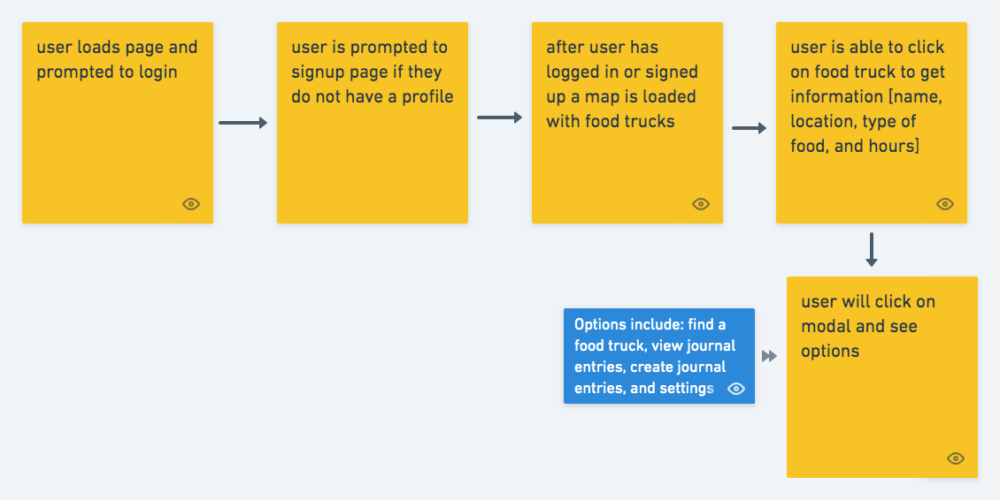

# Bite 'N Go
​Users are able to see food trucks in San Francisco and write posts about different food trucks they visit.​ [Test our app](https://bitengo.herokuapp.com/)
​
## Technologies Used
[Node](https://nodejs.org/en/)
​

[Express](https://expressjs.com/)
​

[MongoDB](https://www.mongodb.com/)
​

[Bulma](https://bulma.io/)
​

[Animate.css](https://daneden.github.io/animate.css/)

[Mapbox](https://www.mapbox.com/)

[Data SF API](https://data.sfgov.org/Economy-and-Community/Mobile-Food-Schedule/jjew-r69b)
​
​
## Existing Features
* Sign Up | Sign In
* Create | Update | Delete Post
​
​
## Planned Features
* Authenticate Users
* Upload Picture to Post
* Populate input when you update
* Filter search by distance, hours and specific food type
* Update user information
​
## Wireframes

​
## User Stories

​

## Screenshot
​
​
### Authors
​
__Kesha & Cat__